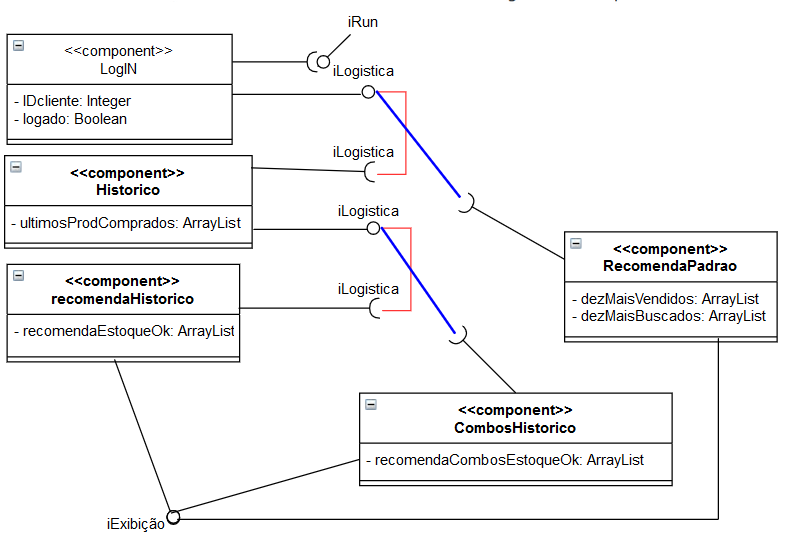

## Lab01 - Data Flow

### ALUNO
   >Tatiany Fermino Rodrigues de Oliveira
  

## Projeto Orange / Análise de Dados do Google PlayStore
### Imagem do Projeto
  
 	
### Arquivo do Projeto
   [Baixe aqui o arquivo do projeto.](orange/google-playstore-preparation.ows)
 
### Gráfico(s) de Análise
  
 
 
  
 
## Projeto Orange / Regras de Associação para Foodmart
### Imagem do Projeto
  
 
### Arquivo do Projeto
  
 
## Projeto de Composição de Componentes para Recomendação
  
   
## Projeto de Composição de Componentes para Pedido
### Diagrama de Componentes
  
 
### Diagrama de Interfaces
  
