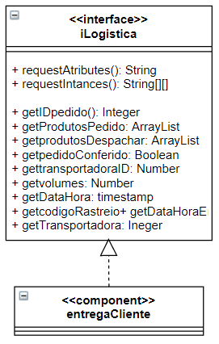

## Lab01 - Data Flow

### ALUNO
   >Tatiany Fermino Rodrigues de Oliveira
  

## Projeto Orange / Análise de Dados do Google PlayStore
### Imagem do Projeto
  
 	
### Arquivo do Projeto
   [Baixe aqui o arquivo deste projeto.](orange/google-playstore-preparation.ows)
 
### Gráfico(s) de Análise
  
 
 
  
 
## Projeto Orange / Regras de Associação para Foodmart
Com o que se observa das associações feitas de forma automática no uso dos componentes </b></i>Frequent Itemsets</b></i> e </b></i>Association Rules</b></i> pode se construir a engenharia de recomendação de produtos para clientes. No componente Association Rules, por exemplo, pode-se inserir um produto "x" já selecionado pelo cliente na sessão de "Antecedent" assim pode-se recomendar produtos que frequentemente são comprados juntos com aquele já escolhido com as taxas de Suporte e Confiança mais altas. No componente Frequent Itemsets a aplicação também é a mesma podendo levar o nome, ou parte do nome do produto selecionado e buscar os produtos associados.
### Imagem do Projeto
  
 Aplicando "Association Rules":

 Aplicando "Frequent Itemsets":

### Arquivo do Projeto
  [Baixe aqui o arquivo deste projeto.](orange/projeto1.ows)
 
## Projeto de Composição de Componentes para Recomendação
  
   
## Projeto de Composição de Componentes para Pedido
### Diagrama de Componentes
  
 
### Diagrama de Interfaces
  
