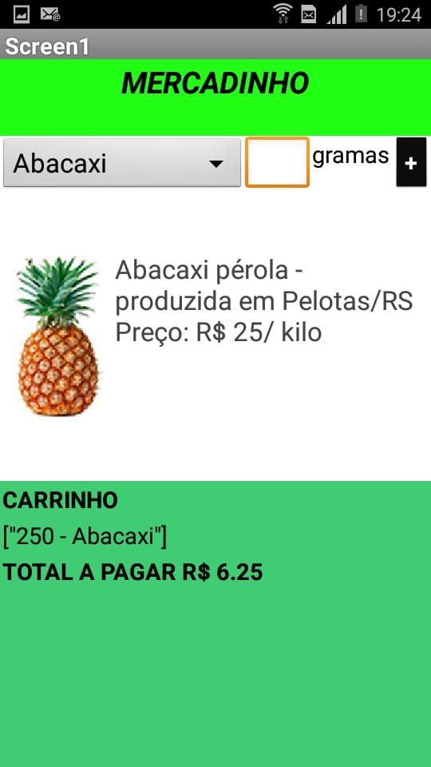

## Lab03 - Model-View-Controller
### Orquestração e Coreografia 
#### ALUNO
Tatiany Fermino Rodrigues de Oliveira  
## Tarefa 1 - Diagrama de Orquestração

Segue o diagrama de atividades com o fluxo de execução que vai desde o pedido de um produto até a sua entrega para o cliente.
   
 
## Tarefa 2 - Diagrama de Coreografia
     
    Segue a sequência esperada de ações:
Exemplo:
        o componente X posta uma mensagem com o tópico Y;
        os componentes do tipo A que assinam o tópico X fazem Z e postam uma mensagem com o tópico W.
 
## Tarefa 3
Seguem as telas do meu aplicativo "Mercadinho":
   * Tela 1 - nenhum produto selecionado
     
   * Tela 2 - primeiro produto selecionado
     
   * Tela 3 - segundo produto selecionado
     
   * Tela 4 - compra de um dos produtos efetiva
	  
   * Tela 5 - diagrama de blocos do aplicativo
	  
   * Tela 6 (extra) - Select de produtos
	  
	* Tela 7  (extra) - 2 produtos no carrinho
	  
## Tarefa 4
Imagens da Equipe 6 postadas no endereço [https://github.com/inf331equipe6.](https://github.com/inf331equipe6)
