## Lab03 - Model-View-Controller
### Orquestração e Coreografia 
Tatiany Fermino Rodrigues de Oliveira  
## Tarefa 1 - Diagrama de Orquestração

Segue o diagrama de atividades com o fluxo de execução que vai desde o pedido de um produto até a sua entrega para o cliente.
   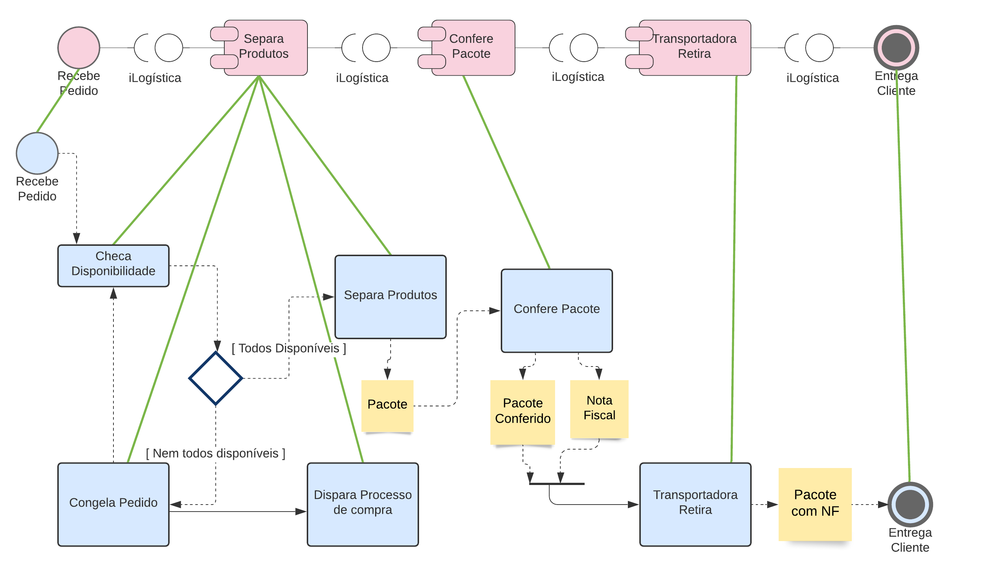
 
## Tarefa 2 - Diagrama de Coreografia
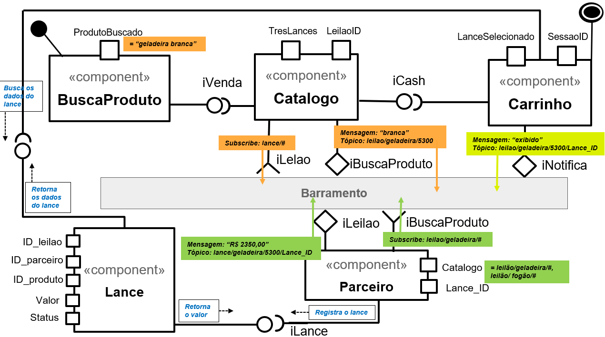  
 <b>Segue a sequência esperada de ações:</b>
1) Através da interface iVenda o componente Catalogo captura do componente BuscaProduto a propriedade ProdutoBuscado que tem uma string com as palavras chaves buscadas pelo cliente "geladeira branca".
2) Através da interface iBuscaProduto o componente Catalogo assina os seu tópicos de interesse que servirão para receber os lances dos parceiros: "lance/#". 
3) Através da interface iLeilao o componente Parceiro assina os seu tópicos de interesse guardados na propriedade Catalogo, separados por vírgula, são eles: "leilao/geladeira/#, leilao/fogao/#". 
4) O componente Catalogo analisa a string ProdutoBuscado que chega através da interface iVenda e cria um ou mais tópicos para postar no Barramento.
5) Para cada tópico definido pelo componente Catalogo é criado um Leilao_ID que é utilizado como subtópico, por exemplo: "leilao/geladeira/5300".
6) Quando entra no barramento alguma mensagem de algum tópico assinado pelo componente Parceiro, o mesmo registra o seu lance no componente Lance e envia para o barramento a mensagem com o preço para o ProdutoBuscado através da interface iLeilao: "Mensagem: 'R$ 2350,00' Tópico: lance/geladeira/Lance_ID".
7) Através da interface iLeilao o componente Catalogo captura as mensagens com os menores preços, guarda as referências das 3 menores que chegarem primeiro em sua propriedade TresLances.
8) O componente Carrinho através da interface iCash captura a propriedade TresLances do componente Catalogo e busca no Componente Lance os dados para apresentar para o cliente.
9) O componente Carrinho através da interface iNotifica envia para o barramento 3 mensagens para notificar os parceiros donos dos 3 menores lances: "Mensagem: 'exibido' Tópico: leilao/geladeira/5300/<Lance_ID>".
10) Os outros parceiros que continuam observando o tópico "leilao/geladeira/5300" e não tiverem seus lances exibidos já podem excluir seus lances e enviar um mensagem "unsubscribe: leilao/geladeira/5300".

## Tarefa 3
Seguem as telas do meu aplicativo "Mercadinho":
 <table border="0"><tr><td>Tela 1  Nenhum produto selecionado 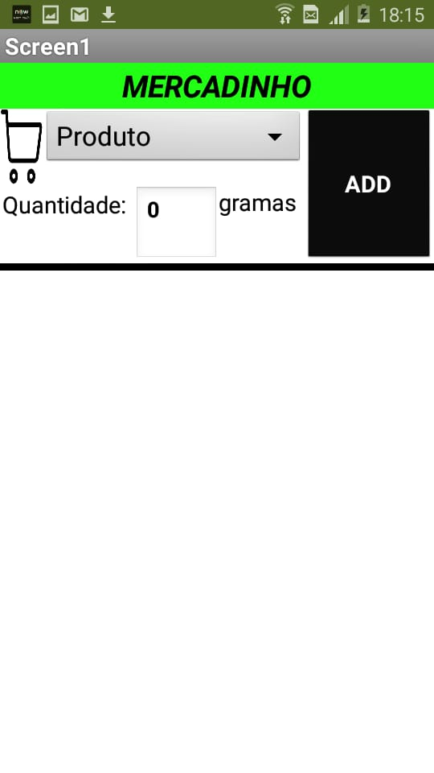</td><td>Tela 2 Primeiro produto selecionado  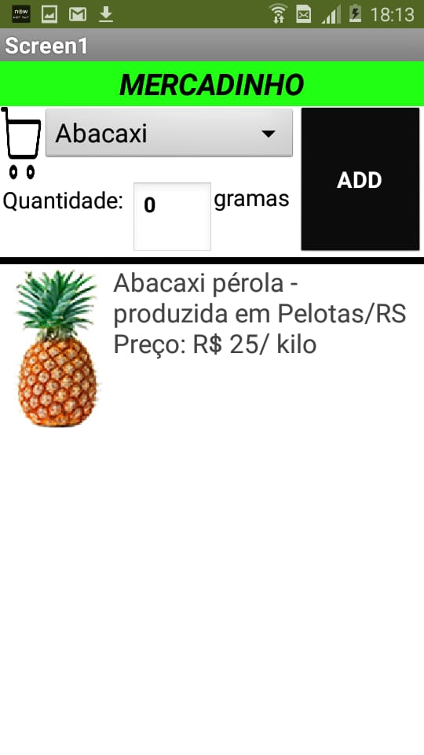</td><td>Tela 3  Segundo produto selecionado  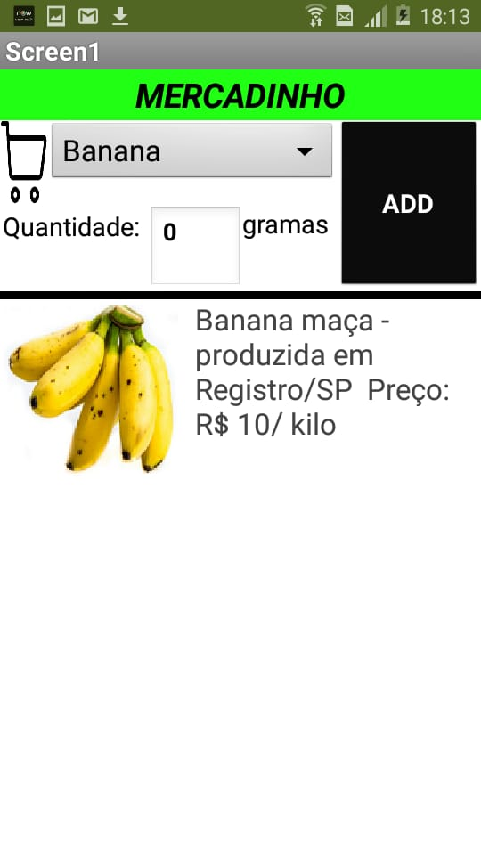</td></tr><tr><td>Tela 4  Compra de um dos produtos efetiva Compra de um dos produtos efetiva" src="images/tela4_v2.jpeg" width="60%" height="60%" /></td><td> Tela 5 (extra)  Select de produtos  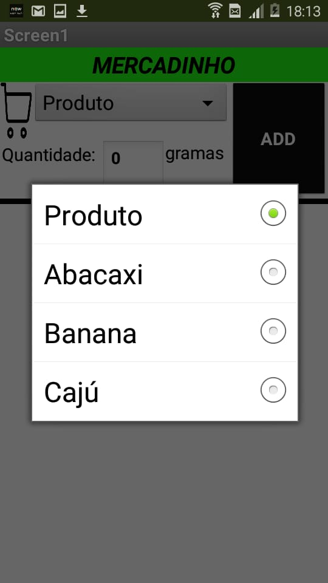</td><td> Tela 6  (extra)  2 produtos no carrinho  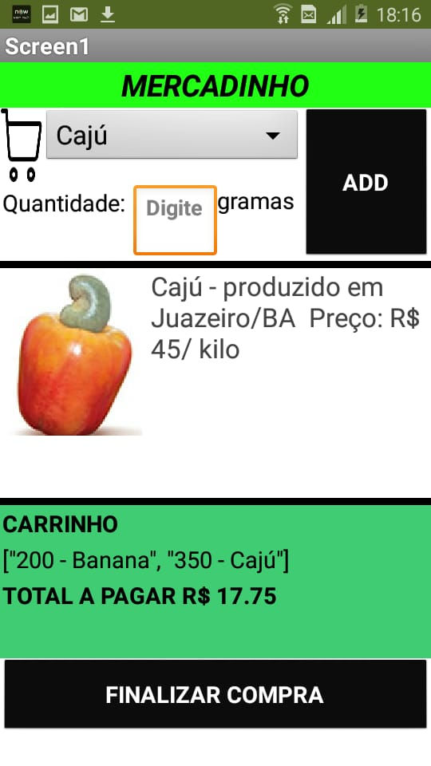</td></tr></table>
 

Mercadinho  - Versão 1

<table border="0"><tr><td>Tela 1  Nenhum produto selecionado 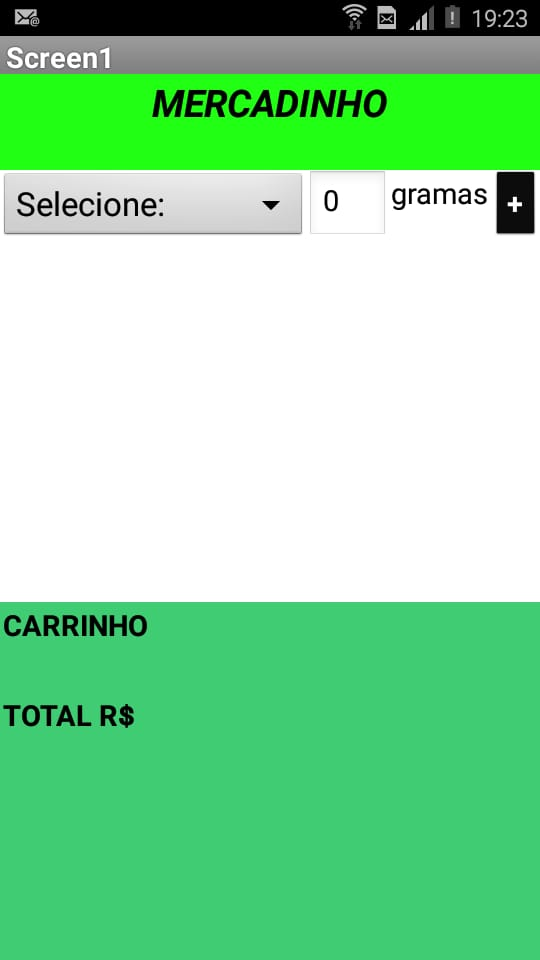</td><td>Tela 2 Primeiro produto selecionado  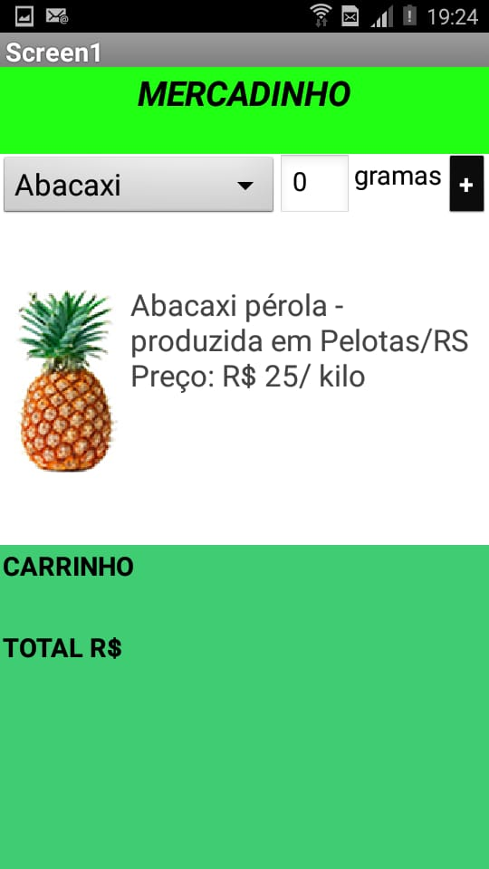</td><td>Tela 3  Segundo produto selecionado  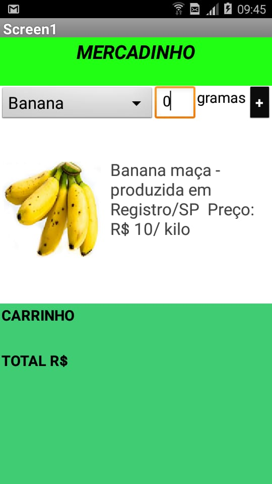</td></tr><tr><td>Tela 4  Compra de um dos produtos efetiva Compra de um dos produtos efetiva" src="images/tela4.jpeg" width="60%" height="60%" /></td><td> Tela 5 (extra)  Select de produtos  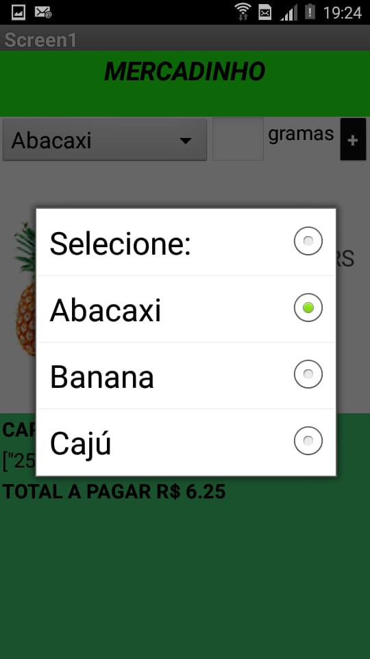</td><td> Tela 6  (extra)  2 produtos no carrinho  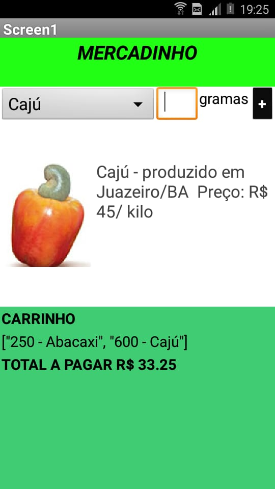</td></tr></table>
 <b> Diagrama de blocos do aplicativo</b>
	  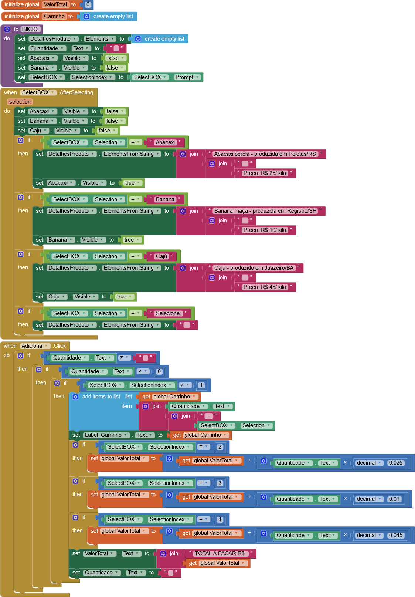 	
</datails>
	
<b> Diagrama de blocos do aplicativo</b>
	  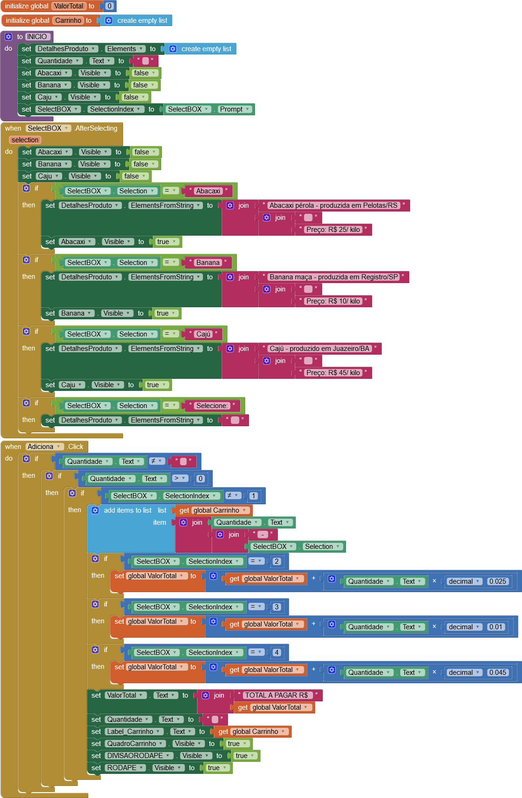 
 	
[Baixe aqui o arquivo do aplicativo exportado a partir do MIT App Inventor em formato aia.](app/Mercadinho.aia) 
   
## Tarefa 4
Imagens da Equipe 6 postadas no endereço [https://github.com/inf331equipe6.](https://github.com/inf331equipe6)
