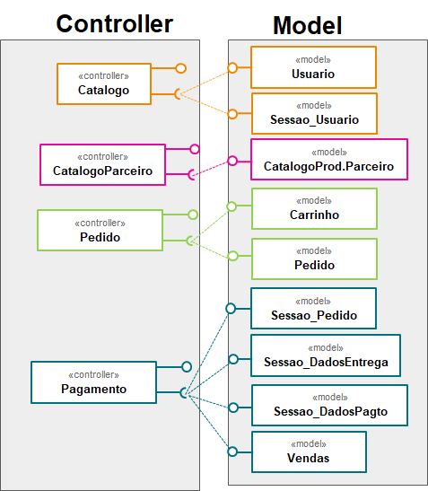

# Lab04 - Serviços
> Tatiany Fermino Rodrigues de Oliveira

## Tarefa 1 - Componentes de Negócio
> 
> 

## Tarefa 2 - Componentes Técnicos
> 
> 

## Tarefa 3 - Componentes Técnicos
> 
> 

## Tarefa 4 - Usando APIs

### Serviço  `<Printwayy>`

* **Título do serviço**: `<API de Integração do PrintWayy>`
* **Breve descrição**:
  > Api que busca no servidores do sistema Printwayy os contadores(Páginas PB, Páginas Color e Digitalizações) de determinada impressora cujo n~umero serial foi enviado como parametro, juntamente com o token de cliente e datas incial e final.
* **URL completa da requisição**: `<https://ws.printwayy.com/api/Printer?api_token=3A7D4830-3587-4C04-A8DC-873CE78434BA&serialNumbers=X686P600567&initialDate=26-08-2020&endDate=26-08-2020>`
* **Cabeçalho HTTP da chamada**:
~~~http
GET /api/Printer?api_token=3A7D4830-3587-4C04-A8DC-873CE78434BA&serialNumbers=X686P600567&initialDate=26-08-2020&endDate=26-08-2020 HTTP/1.1
Host: ws.printwayy.com
User-Agent: Mozilla/5.0 (Windows NT 10.0; Win64; x64; rv:80.0) Gecko/20100101 Firefox/80.0
Accept: text/html,application/xhtml+xml,application/xml;q=0.9,image/webp,*/*;q=0.8
Accept-Language: pt-BR,pt;q=0.8,en-US;q=0.5,en;q=0.3
Accept-Encoding: gzip, deflate, br
Connection: keep-alive
Cookie: _ga=GA1.2.1687216029.1596035560; _hp2_id.3652070699=%7B%22userId%22%3A%224914952022567139%22%2C%22pageviewId%22%3A%22230617591926261%22%2C%22sessionId%22%3A%225724077889323231%22%2C%22identity%22%3A%22suporte%40mpimpressoras.com.br%22%2C%22trackerVersion%22%3A%224.0%22%2C%22identityField%22%3Anull%2C%22isIdentified%22%3A1%7D; __zlcmid=zQjJuPuGiAMDpx
Upgrade-Insecure-Requests: 1
~~~
* **Cabeçalho HTTP da resposta**:
~~~http
HTTP/1.1 200 OK
Cache-Control: no-cache
Pragma: no-cache
Content-Type: application/xml; charset=utf-8
Expires: -1
Server: Microsoft-IIS/8.5
X-AspNet-Version: 4.0.30319
X-Powered-By: ASP.NET
Date: Fri, 28 Aug 2020 14:34:43 GMT
Content-Length: 2081
~~~
* **Conteúdo da resposta**:
~~~json
<BaseResponse xmlns:i="http://www.w3.org/2001/XMLSchema-instance" i:type="PrinterResponse" xmlns="http://schemas.datacontract.org/2004/07/Southwayy.PrintWayy.WebService.Models"><Code>0</Code><Success>true</Success><Printers><Printer><SerialNumber>X686P600567</SerialNumber><Department>IMP-PRODUTOS COLOR</Department><IPAddress>10.0.2.250</IPAddress><Location>Vinhedo</Location><AssetNumber></AssetNumber><Contract>ATTA</Contract><GeneralCountStartDateOfCapture>2020-08-25T23:59:42.313</GeneralCountStartDateOfCapture><GeneralCountEndDateOfCapture>2020-08-26T23:31:53.377</GeneralCountEndDateOfCapture><GeneralCountStart>40038</GeneralCountStart><GeneralCountEnd>40038</GeneralCountEnd><MonoCountStartDateOfCapture>2020-08-25T23:59:42.313</MonoCountStartDateOfCapture><MonoCountEndDateOfCapture>2020-08-26T23:31:53.377</MonoCountEndDateOfCapture><MonoCountStart>11555</MonoCountStart><MonoCountEnd>11555</MonoCountEnd><ColorCountStartDateOfCapture>2020-08-25T23:59:42.313</ColorCountStartDateOfCapture><ColorCountEndDateOfCapture>2020-08-26T23:31:53.377</ColorCountEndDateOfCapture><ColorCountStart>28483</ColorCountStart><ColorCountEnd>28483</ColorCountEnd><ScanCountStartDateOfCapture>0001-01-01T00:00:00</ScanCountStartDateOfCapture><ScanCountEndDateOfCapture>0001-01-01T00:00:00</ScanCountEndDateOfCapture><ScanCountStart>0</ScanCountStart><ScanCountEnd>0</ScanCountEnd><A3MonoCountStartDateOfCapture>0001-01-01T00:00:00</A3MonoCountStartDateOfCapture><A3MonoCountEndDateOfCapture>0001-01-01T00:00:00</A3MonoCountEndDateOfCapture><A3MonoCountStart>0</A3MonoCountStart><A3MonoCountEnd>0</A3MonoCountEnd><A3ColorCountStartDateOfCapture>0001-01-01T00:00:00</A3ColorCountStartDateOfCapture><A3ColorCountEndDateOfCapture>0001-01-01T00:00:00</A3ColorCountEndDateOfCapture><A3ColorCountStart>0</A3ColorCountStart><A3ColorCountEnd>0</A3ColorCountEnd><A3CountStartDateOfCapture>0001-01-01T00:00:00</A3CountStartDateOfCapture><A3CountEndDateOfCapture>0001-01-01T00:00:00</A3CountEndDateOfCapture><A3CountStart>0</A3CountStart><A3CountEnd>0</A3CountEnd></Printer></Printers></BaseResponse>
~~~

### Serviço `<ODWeather>`

* **Título do serviço**: `<ODWeather>`
* **Breve descrição**:
  > Sistema que busca informações do tempo capturadas por determinada estação(parametro 1) em determinado periodo(parametro 2) através de sua API.
* **URL completa da requisição**: `<https://any-api.com:8443/http://api.oceandrivers.com/v1.0/getWeatherDisplay/cncg/?period=latestdata>`
* **Cabeçalho HTTP da chamada**:
~~~http
GET /http://api.oceandrivers.com/v1.0/getWeatherDisplay/cncg/?period=latestdata HTTP/2
Host: any-api.com:8443
User-Agent: Mozilla/5.0 (Windows NT 10.0; Win64; x64; rv:80.0) Gecko/20100101 Firefox/80.0
Accept: application/json
Accept-Language: pt-BR,pt;q=0.8,en-US;q=0.5,en;q=0.3
Accept-Encoding: gzip, deflate, br
Origin: https://any-api.com
Connection: keep-alive
Referer: https://any-api.com/oceandrivers_com/oceandrivers_com/console/ODWeather/getWeatherDisplay
~~~
* **Cabeçalho HTTP da resposta**:
~~~http
HTTP/2 200 OK
date: Fri, 28 Aug 2020 13:55:28 GMT
content-type: application/json
set-cookie: __cfduid=dfb16b0095524dd897aec097978f0138f1598622925; expires=Sun, 27-Sep-20 13:55:25 GMT; path=/; domain=.any-api.com; HttpOnly; SameSite=Lax
x-request-url: http://api.oceandrivers.com/v1.0/getWeatherDisplay/cncg/?period=latestdata
x-cors-redirect-1: 301 https://api.oceandrivers.com/v1.0/getWeatherDisplay/cncg/?period=latestdata
access-control-allow-origin: *
access-control-allow-methods: POST, GET, OPTIONS, DELETE, PUT
access-control-max-age: 1000
access-control-allow-headers: x-requested-with, Content-Type, origin, authorization, accept, client-security-token
x-final-url: https://api.oceandrivers.com/v1.0/getWeatherDisplay/cncg/?period=latestdata
access-control-expose-headers: date,server,content-length,access-control-allow-origin,access-control-allow-methods,access-control-max-age,access-control-allow-headers,connection,content-type,x-final-url
cf-cache-status: DYNAMIC
cf-request-id: 04d6f31c070000f6f4051b1200000001
expect-ct: max-age=604800, report-uri="https://report-uri.cloudflare.com/cdn-cgi/beacon/expect-ct"
server: cloudflare
cf-ray: 5c9e87a67f35f6f4-GRU
content-encoding: br
X-Firefox-Spdy: h2
~~~
* **Conteúdo da resposta**:
~~~json
{"TWS_GUST_MAX":{"TIME_STRING":"28-8-2020 12:26_PM:00","VALUE":"11.3"},"TWD":269,"HUMIDEX":40.3,"TWS":0,"LOCALTIME":2,"HUMIDITY_IN":100,"WINDCHILL":29.3,"TEMP_IN":39,"ICON_NOW":"5","ICON_FOR":"5","TEMPERATURE":29.3,"TWS_GUST":0,"RAIN":0,"PRESSURE":1004.8,"LONGITUDE":2.6941180499153,"ACTIVE":"ON","PRESSURE_TR":-0.9,"RAIN_MONTH":0.2,"RAIN_DAY":0,"HUMIDITY":72,"TIME_STRING":"28-8-2020 15:48:08","TIME":1598622488000,"LATITUDE":39.546820364112,"WEATHER_DES":"Dry"}
~~~
